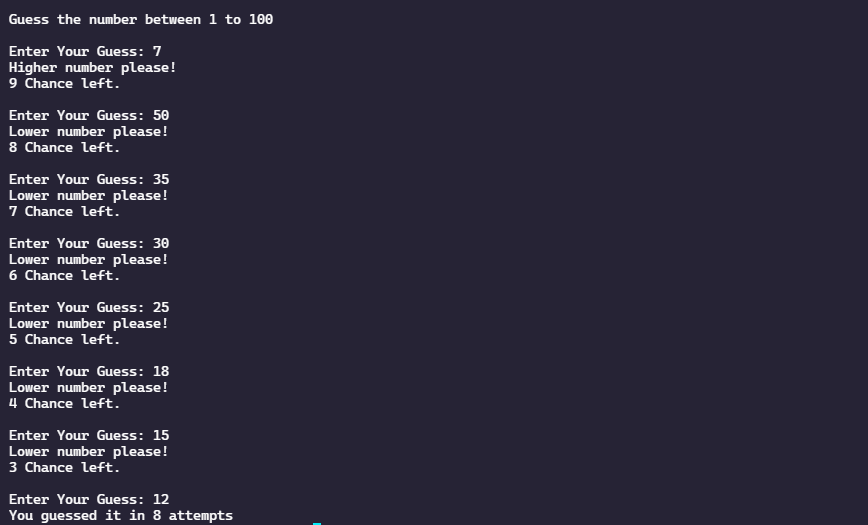

# Number Guessing Game
<h3 align="left">Description: </h3>

One of the simplest two-player games is “Guess the number”. The first player thinks of a secret number
in some known range while the second player attempts to guess the number. After each guess, the first
player answers either “Higher”, “Lower” or “Correct!” depending on whether the secret number is
higher, lower or equal to the guess.

<h3 align="left">What we are gonna do?</h3>

The random function generates the number between 1 to 100.
The user has 10 chances to guess the number.
So, we ask max 10 times to user to enter a number.
Once the user guess is matched with an actual number then user has won the game and the game will be over.
Every time user also sees how many number of chances are left.
If the user can’t guess the number then the game is over and it will also show the actual number that was supposed. Simple!!

<h3 align="left">Concepts that are used: </h3>

 - If Else  
 - While Loop  
 - Random Function  

<h3 align="left">Languages and Tools:</h3>

<h3 align="left">Output Screenshot:</h3>

